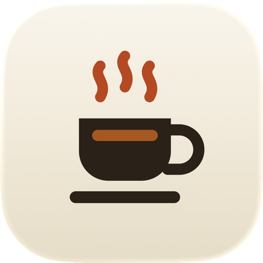
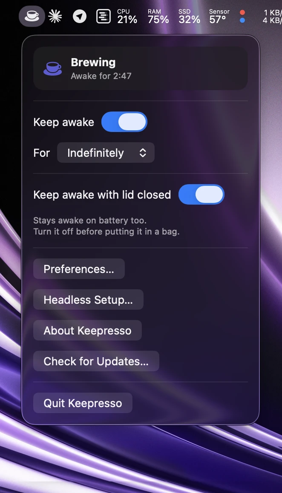
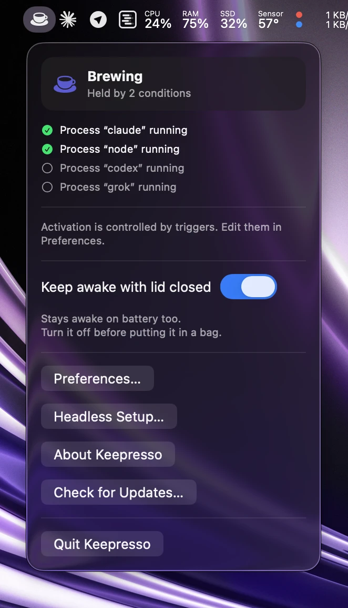
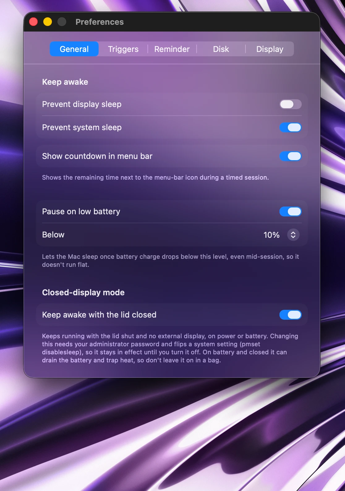
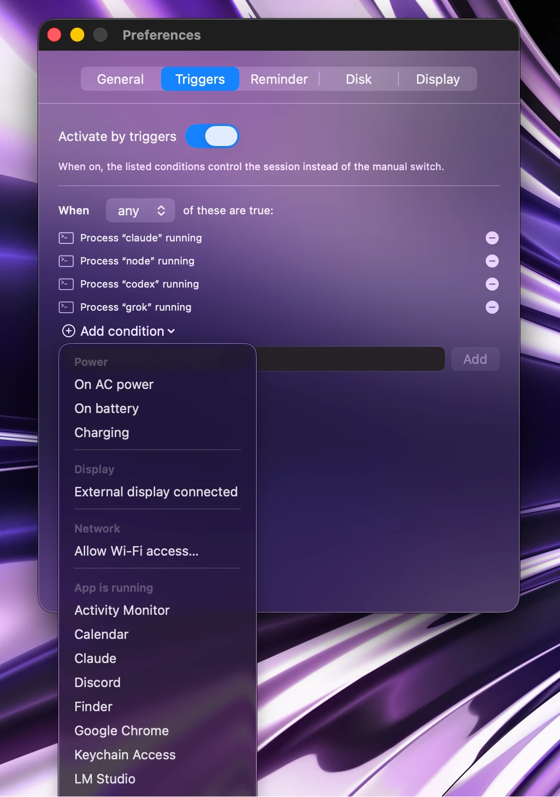
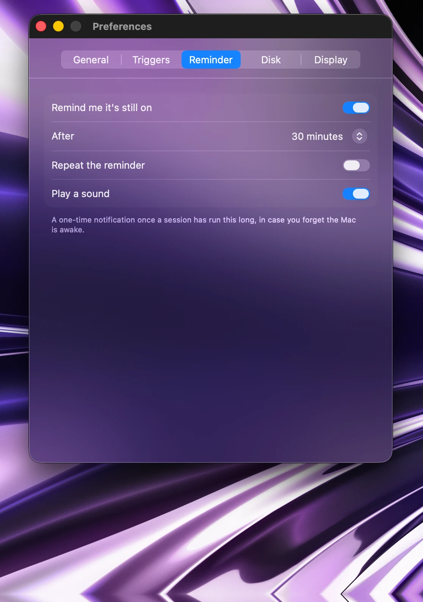
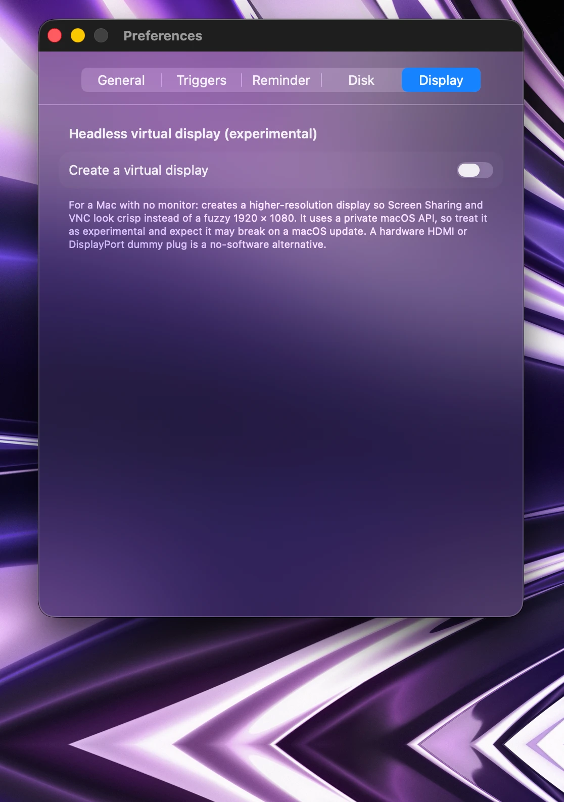

<p align="center">
  
</p>

<h1 align="center">Keepresso</h1>

<p align="center">
  Keep your Mac awake, on your terms, with smart triggers, presets, timed
  sessions, and closed-display mode in a clean, native menu-bar app, built on a
  modern foundation for the next decade of computing.
</p>

<p align="center">
  <a href="https://github.com/gyorgysh/keepresso/actions/workflows/ci.yml"></a>
  
  
  <a href="LICENSE"></a>
</p>

---

Keepresso is a native **Swift + SwiftUI** menu-bar app. It uses macOS power
assertions (`IOPMAssertion`) to prevent system and display sleep, and layers on
condition-based **triggers** so your Mac only stays awake when it actually should.
It lives quietly in the menu bar, no Dock icon, no clutter.

<p align="center">
  
  &nbsp;&nbsp;
  
</p>

## Features

- ☕ **Keep awake, your way.** Prevent system sleep and/or display sleep as
  independent toggles, indefinitely, for a timed session (presets or any custom
  duration), or **until a wall-clock time** ("until 18:00", today or tomorrow).
- 🌙 **Yield the screen saver.** Let the screen saver or display sleep kick in
  after _N_ minutes idle while the system itself stays awake.
- ⚡ **Trigger engine.** Stay awake only while charging or on battery, an external
  display is connected, you're on a chosen Wi-Fi network, a specific app or
  process is running, a chosen **volume is mounted**, **CPU usage** sits above a
  threshold (builds, renders, training runs), or during a **scheduled time
  window** (weekdays 9:00-18:00, overnight hours). Combine conditions with
  **any** (OR) or **all** (AND). A one-click "Pause Triggers" in the menu bar
  stops brewing without touching your rules.
- 🎛️ **Presets.** Apply a named trigger bundle in one click, built-in (AI Agent,
  On AC Power, External Display Connected, Remote Session (SSH), Backup
  Running, Media Render) or your own saved rule sets.
- 🪪 **Auto app detection.** Caffeinate while listed apps run or are frontmost,
  with an optional grace period before it lets go.
- 🔋 **Battery-aware auto-pause.** Let the Mac sleep once charge drops below a
  threshold you choose, even mid-session, so it never runs the battery flat.
- ⏱️ **Menu-bar countdown.** An optional live countdown next to the cup icon for
  timed sessions.
- 🔗 **Shortcuts and URL scheme.** Native Shortcuts actions (Start, Stop,
  Toggle) for Shortcuts, Spotlight, and Siri, plus a URL scheme for Raycast,
  Alfred, or a shell script: `keepresso://start?duration=60`,
  `keepresso://start?until=18:00`, `stop`, or `toggle`.
- 💻 **Closed-display mode.** Keep running with the **lid shut** and no external
  display, on power or battery, for an always-on Mac or one you carry mid-task.
  The screen itself turns off when the lid closes, so it's not sitting lit
  inside a closed lid.
- 🔔 **Reminders.** A "still brewing" notification (with an optional sound) after
  _N_ minutes, one-time or recurring, so a forgotten session can't quietly drain
  the battery.
- 💽 **Disk keep-alive.** Periodic no-op disk I/O to stop an external drive or NAS
  from spinning down.
- 🖥️ **Headless Setup checklist.** Probes the system settings an always-on,
  headless Mac needs (sleep, auto-restart, auto-login, FileVault, remote access)
  and guides you to fix each one.
- 🖼️ **Headless virtual display (experimental).** On a Mac with no monitor,
  create a higher-resolution HiDPI virtual display so Screen Sharing and VNC look
  crisp instead of a fuzzy 1920×1080. Off by default; uses a private macOS API,
  so it's a no-dummy-plug software alternative you should treat as experimental.
- ✨ **Native and quiet.** A menu-bar agent with an animated cup while brewing, a
  live summary of what's holding the session on, and Liquid Glass styling on
  macOS 26+.
- ⬆️ **Self-updating.** Built-in auto-updates via [Sparkle](https://sparkle-project.org),
  with an EdDSA-signed appcast on GitHub Releases.

## Screenshots

<table>
<tr>
<td align="center" width="50%">
  <br>
  <sub>General: keep-awake toggles, menu-bar countdown, battery auto-pause, closed-display mode, launch at login</sub>
</td>
<td align="center" width="50%">
  <br>
  <sub>Trigger engine: combine AC power, Wi-Fi, displays, and app conditions, or apply a preset</sub>
</td>
</tr>
<tr>
<td align="center" width="50%">
  <br>
  <sub>Reminders: a "still brewing" alert so a forgotten session can't drain the battery</sub>
</td>
<td align="center" width="50%">
  <br>
  <sub>Headless virtual display: crisp Screen Sharing on a Mac with no monitor</sub>
</td>
</tr>
</table>

## Built for the agentic era

**The only app you'll ever need for a headless Mac setup**, whether it's running
AI agents, a server, a render farm, or anything reachable over HTTP or SSH.
Keepresso fits the way Macs are used now, and where they're headed:

- 🤖 **AI agents.** Keep a Mac awake and reachable so agents can operate it around
  the clock without it dozing off mid-task.
- 💻 **MacBooks on the go.** Closed-display mode keeps work running on power or
  battery while you pack up and move.
- 🧑‍💻 **Builders and vibe coders.** Long builds, training runs, and overnight jobs
  finish instead of getting cut short by sleep.
- 🏢 **Business and enterprise, no charge.** Headless Mac minis and Mac Studios
  powering local LLMs, agent fleets, CI, or a render farm stay up without a
  license fee.
- 🎬 **Studios.** Long renders and exports run to completion, untended.

The use cases are effectively limitless. Modern UI, a solid and well-tested
foundation, and a quiet must-have for the next decade of computing.

## Install

**Homebrew:**

```sh
brew install --cask gyorgysh/keepresso/keepresso
```

**Manual:** download the latest signed, notarized DMG from
[Releases](https://github.com/gyorgysh/keepresso/releases), drag **Keepresso** to
Applications, and launch it.

Either way, Keepresso keeps itself up to date from there.

## Using Keepresso

Click the cup in the menu bar to open Keepresso.

- **Quick toggle.** Flip **Keep awake** on or off and pick a duration:
  indefinitely, a preset (15 minutes, 1 hour, 4 hours), any custom duration, or
  until a time of day. The cup fills and animates while brewing.
- **Keep awake with lid closed.** Toggle it right from the menu before you shut
  the lid or unplug. It asks for your administrator password once, because it
  flips a system setting (`pmset disablesleep`), and works on power or battery.
  Turn it off when you're done; on battery in a bag it can drain and heat up.
- **Preferences** (⌘,) holds the set-and-forget configuration, in tabs:
  - **General**: what to keep awake, menu-bar countdown, battery auto-pause,
    closed-display mode, launch at login.
  - **Triggers**: turn on rule-based activation, apply a preset, and build your
    rule set.
  - **Reminder**: a one-time or recurring "still brewing" alert, with a sound.
  - **Disk**: choose a volume to keep spun up and how often to touch it.
  - **Display**: create an experimental high-resolution headless virtual display.
- **Headless Setup** checks that an always-on Mac (say a Mac mini with no display)
  is configured to stay reachable, and links you straight to the right settings.

Keepresso has no Dock icon by design. Everything lives in the menu bar.

### Driving it from Shortcuts or a script

Keepresso ships native **Shortcuts actions**: Start Keeping Awake (optionally
for _N_ minutes), Stop Keeping Awake, and Toggle Keep Awake, usable from the
Shortcuts app, Spotlight, and Siri.

It also registers a `keepresso://` URL scheme so Raycast, Alfred, or a shell
script can start or stop a session without opening the menu:

```
open "keepresso://start"              # indefinite session
open "keepresso://start?duration=60"  # timed session, in minutes
open "keepresso://start?until=18:00"  # until a wall-clock time (24h HH:MM)
open "keepresso://stop"
open "keepresso://toggle"
```

Either way, if triggers are on they pause first (same as the menu's Pause
Triggers), so the command actually takes effect.

## Why not the Mac App Store?

The App Sandbox blocks the `IOPMAssertion` power APIs Keepresso depends on, so
it's distributed **outside** the store, as a direct, notarized DMG download.

## Building from source

Keepresso uses **[XcodeGen](https://github.com/yonaskolb/XcodeGen)** to generate
the Xcode project from [`project.yml`](project.yml) (the `.xcodeproj` is **not**
checked in), and **Swift Package Manager** for the testable core
([`KeepressoCore`](Sources/KeepressoCore)).

**Requirements:** macOS 14+, Xcode 16+, `xcodegen` (`brew install xcodegen`).

```sh
git clone https://github.com/gyorgysh/keepresso.git
cd keepresso

./scripts/run.sh            # generate the project and open it in Xcode (⌘R to run)
```

### Working on the core logic

The sleep-control state machine lives in `KeepressoCore` and is fully unit
tested, independent of any UI:

```sh
swift build      # build the core library
swift test       # run the test suite (requires the full Xcode toolchain)
```

### How it works

Two layers, by design:

- **`KeepressoCore`** is a SwiftUI-free SwiftPM library: the `SessionController`
  state machine plus protocol seams over every system touchpoint (power
  assertions, power source, displays, network, workspace, disk, notifications).
  This is where behavior lives and where the tests are.
- **`Keepresso`** is the thin SwiftUI `MenuBarExtra` app: views and lifecycle
  glue wired to the real system backends.

The controller doesn't run its own timer; the app ticks it once a second. Tests
advance a fake clock and inject fakes for the system seams, so the logic is
verified without touching real hardware.

### Scripts

- `scripts/run.sh` — generate the project and open it in Xcode.
- `scripts/make-icon.swift` — regenerate the app icon asset catalog.

See [docs/BUILDING.md](docs/BUILDING.md) for a full build walkthrough and
[CLAUDE.md](CLAUDE.md) for the architecture and contributor workflow.

## Contributing

Issues and pull requests are welcome. New behavior goes in `KeepressoCore` behind
a protocol seam with tests, then a thin SwiftUI layer in the app.

## License

[MIT](LICENSE) © 2026 Keepresso contributors.

If Keepresso is useful to you, you can [support its development](https://gyorgy.sh/donate).
