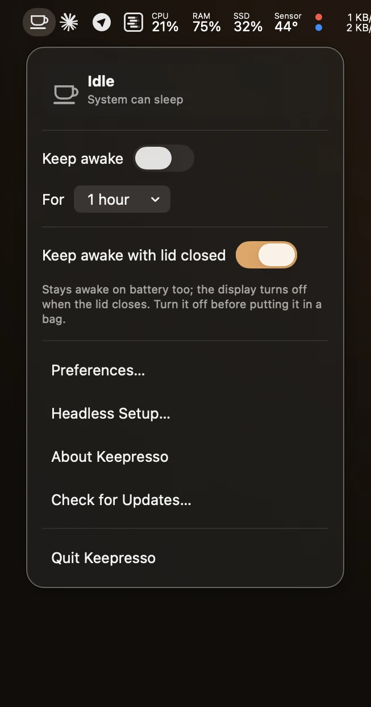
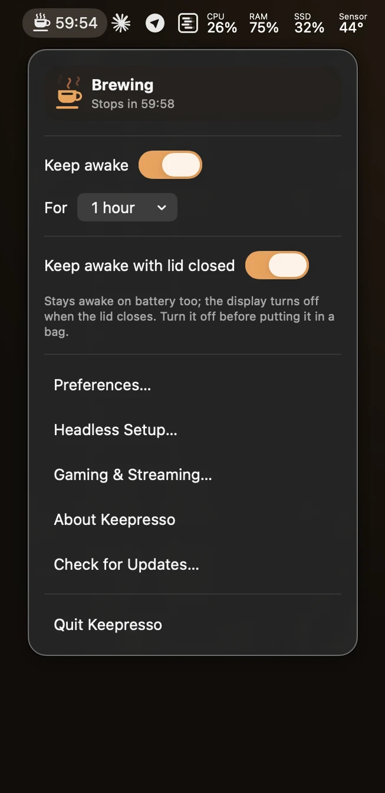
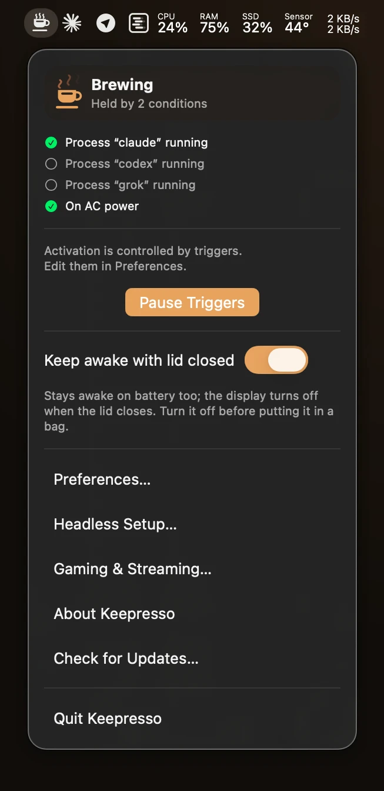
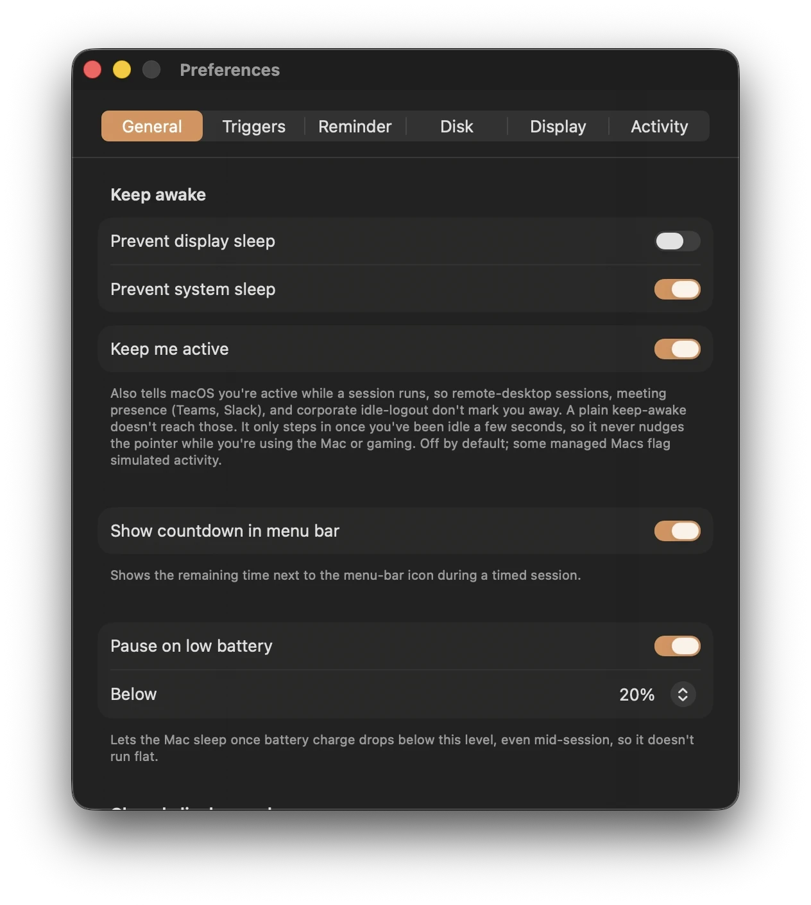
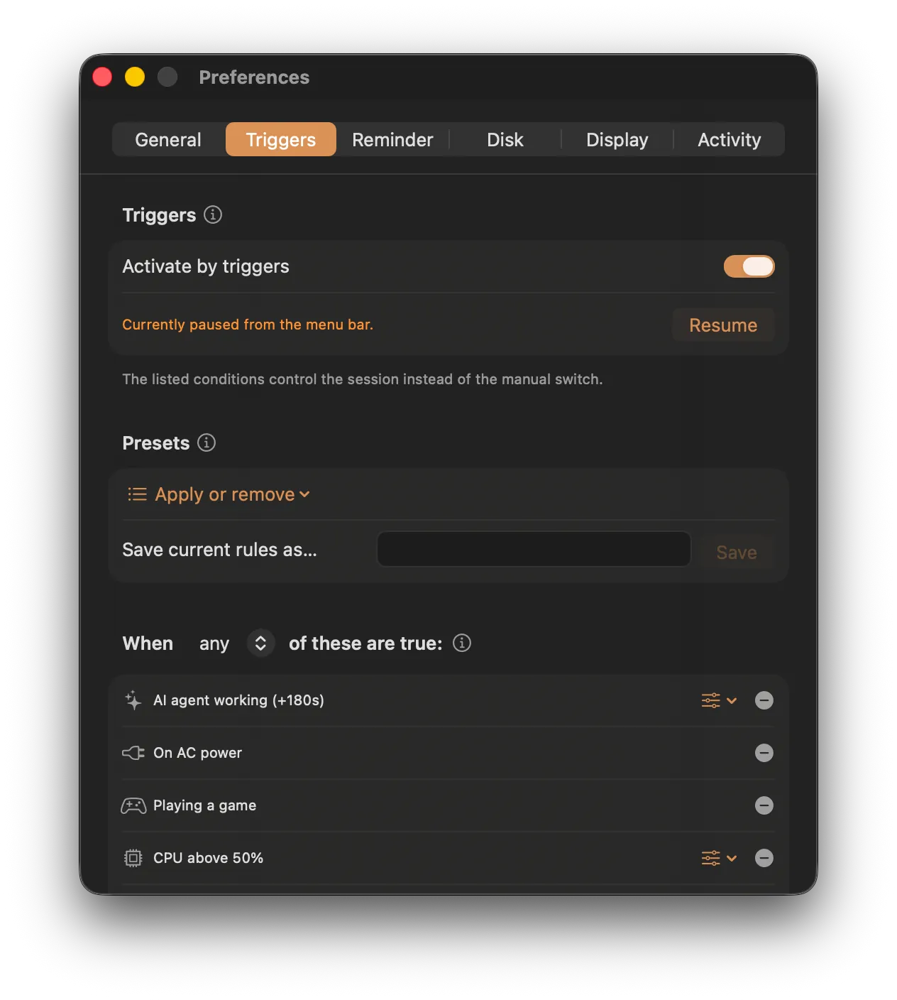
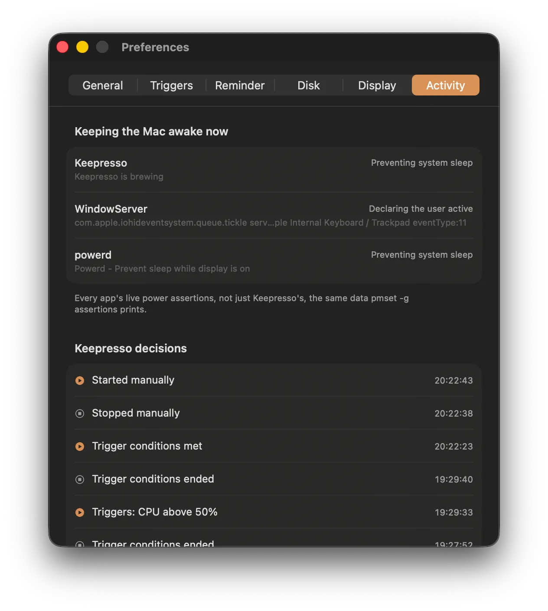
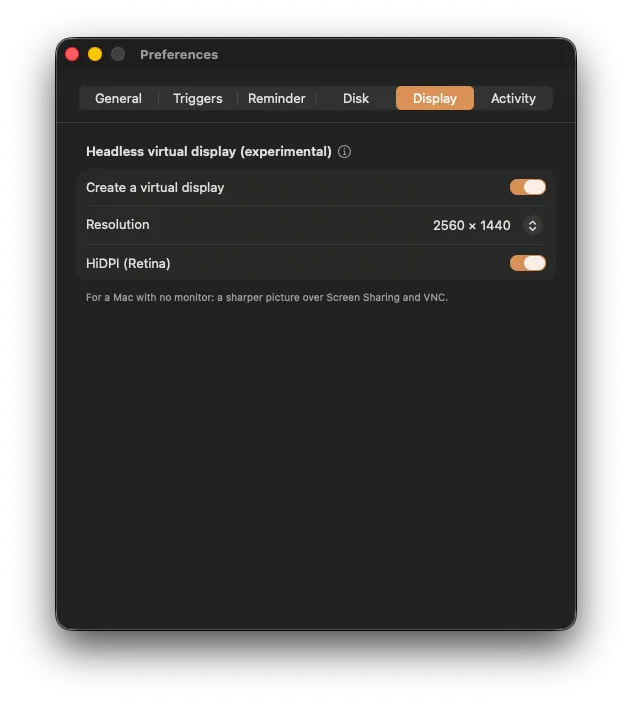
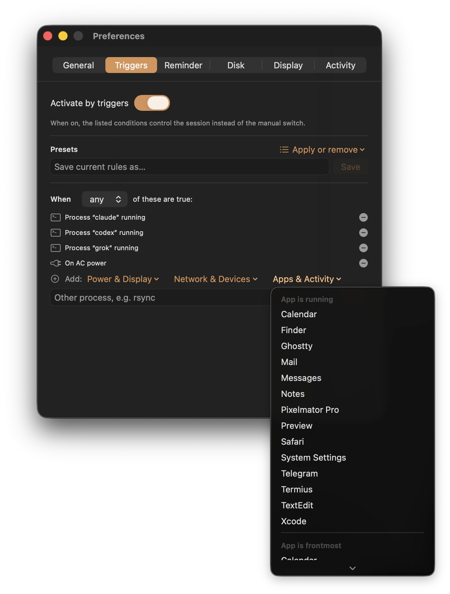

<p align="center">
  
</p>

<h1 align="center">Keepresso</h1>

<p align="center">
  Keep your Mac awake, on your terms, with smart triggers, presets, timed
  sessions, and closed-display mode in a clean, native menu-bar app, built on a
  modern foundation for the next decade of computing.
</p>

<p align="center">
  <a href="https://github.com/gyorgysh/keepresso/actions/workflows/ci.yml"></a>
  
  
  <a href="LICENSE"></a>
</p>

---

Keepresso is a native **Swift + SwiftUI** menu-bar app. It uses macOS power
assertions (`IOPMAssertion`) to prevent system and display sleep, and layers on
condition-based **triggers** so your Mac only stays awake when it actually should.
It lives quietly in the menu bar, no Dock icon, no clutter.

<p align="center">
  
  &nbsp;
  
  &nbsp;
  
</p>

## Features

- ☕ **Keep awake, your way.** Prevent system sleep and/or display sleep as
  independent toggles, indefinitely, for a timed session (presets or any custom
  duration), or **until a wall-clock time** ("until 18:00", today or tomorrow).
- 🌙 **Yield the screen saver.** Let the screen saver or display sleep kick in
  after _N_ minutes idle while the system itself stays awake.
- 🟢 **Keep me active (defeat idle detectors).** A plain power assertion keeps the
  Mac awake but doesn't reset app-level or enterprise idle detection. Optionally
  tell macOS you're active too, so remote-desktop and VDI sessions, meeting
  presence (Teams, Slack), and corporate idle-logout don't mark you away. It only
  steps in once you've been idle a few seconds, so it never nudges the pointer
  while you're using the Mac or gaming. Off by default, and prompt-free (no
  Accessibility permission).
- ⚡ **Trigger engine.** Stay awake only while charging or on battery, an external
  display is connected, you're on a chosen Wi-Fi network, **a VPN is
  connected**, the **camera or microphone is in use**, **audio is playing**, a
  chosen **Bluetooth device is connected** (headphones, a controller), a
  **calendar event is in progress**, a specific app or process is running, a
  chosen **volume is mounted**, **CPU usage** sits above a threshold (builds,
  renders, training runs), **network throughput** stays above a threshold (a
  large download, upload, or sync), a **download is in progress** in a folder you
  choose (keep awake until it finishes), **a game is in front**, or during a
  **scheduled time window** (weekdays 9:00-18:00, overnight hours). Combine
  conditions with **any** (OR) or **all** (AND). A one-click "Pause Triggers"
  in the menu bar stops brewing without touching your rules.
- 🎥 **Never sleeps mid-meeting.** The camera/microphone conditions catch every
  meeting app at once, including calls running in a browser tab, and read only
  the device's in-use state (the green-dot signal), never the stream, so no
  camera or microphone permission is ever requested.
- 🎮 **Game-aware.** The "Playing a game" condition spots apps that declare a
  games category, anything running from a **Steam** library (many Steam games
  skip the declaration), and the cloud and game-streaming clients: **GeForce
  NOW, Boosteroid, Parsec, Moonlight, Shadow**. A five-minute grace means
  alt-tabbing to Discord doesn't drop the session.
- 📶 **Gaming & Streaming Setup.** macOS hops the Wi-Fi radio off-channel for
  AWDL (AirDrop, Handoff, Sidecar) about once a second, which shows up as
  50-100 ms ping spikes mid-game or mid-stream. A dedicated window diagnoses
  it with a built-in **jitter test**, and fixes it with a session-scoped
  **AWDL pause**: no password at all with the administrator helper installed
  (once per launch without it), instant toggling, and everything restores
  itself the moment you stop (even after a crash). An
  **automatic mode** watches for a game (or a cloud-gaming app) on its own with
  no trigger setup, authorizes once up front so it never pops a password dialog
  over a running game, and shows a live status with a grace countdown when a
  game closes. Optional notifications when it pauses and resumes. Plus
  radio-hygiene checks: wired network, Wi-Fi channel alignment with AWDL's
  social channels (44 in the EU, 149 in the US and Canada), Bluetooth, Game Mode.
- 🎛️ **Presets.** Apply a named trigger bundle in one click, built-in (AI Agent,
  Meetings, Cloud Gaming, Remote Control, On AC Power, External Display
  Connected, Remote Session (SSH), Backup Running, Media Render) or your own
  saved rule sets. Deleted a built-in? "Restore default presets" brings it back.
- 👋 **First-run setup.** A welcome window on a new Mac points out that Keepresso
  lives in the menu bar (no Dock icon) and sets you up in one click for how you
  work: agentic coding, gaming and streaming, meetings and calls, or remote
  access. Reopen it any time from Preferences.
- 🧩 **Desktop widgets and a Control Center toggle.** A small widget that's a
  one-tap toggle (the brand cup fills and steams while brewing, with a live
  countdown), a medium widget with Start/Stop and Pause/Resume Triggers
  buttons, and on macOS 26 a Keep Awake control for Control Center.
- 🔍 **Awake explainer.** The Activity pane shows every app's live power
  assertions, a readable `pmset -g assertions`, so you can see exactly what's
  preventing sleep (whoever's doing it), plus a decision log of why each
  Keepresso session started or stopped: which trigger, a timer, the battery
  pause, or a command. The menu bar even names another app that's holding the
  Mac awake ("Held by Google Chrome") when Keepresso itself is idle.
- 🪪 **Auto app detection.** Caffeinate while listed apps run or are frontmost,
  with an optional grace period before it lets go.
- 🔋 **Battery-aware auto-pause.** Let the Mac sleep once charge drops below a
  threshold you choose, even mid-session, so it never runs the battery flat.
- ⏱️ **Menu-bar countdown.** An optional live countdown next to the cup icon for
  timed sessions.
- ⌨️ **Global hotkey.** A system-wide keyboard shortcut to toggle keep-awake from
  any app, recorded in Preferences (Carbon-based, so no Input Monitoring or
  Accessibility permission).
- 🚀 **Start on launch.** Optionally begin a keep-awake session the moment
  Keepresso launches, for an always-on Mac that shouldn't need a rule.
- 💾 **Export and import.** Back up your settings, triggers, and presets to a JSON
  file, or move them to another Mac, from Preferences > General. The file is
  version-stamped and validated on import.
- 🔗 **Shortcuts and URL scheme.** Native Shortcuts actions (Start, Stop,
  Toggle) for Shortcuts, Spotlight, and Siri, plus a URL scheme for Raycast,
  Alfred, or a shell script: `keepresso://start?duration=60`,
  `keepresso://start?until=18:00`, `stop`, or `toggle`.
- 💻 **Closed-display mode.** Keep running with the **lid shut** and no external
  display, on power or battery, for an always-on Mac or one you carry mid-task.
  The screen itself turns off when the lid closes, so it's not sitting lit
  inside a closed lid. An optional **"Only while brewing"** mode ties it to the
  session instead of leaving it on globally: on when a keep-awake session
  starts, off when it ends (or the app quits, even after a crash), with the
  password asked once per app run, or never with the administrator helper.
- 🔑 **One password, ever.** An optional **administrator helper**, a small
  system service installed from Preferences > General (or the welcome screen),
  handles the privileged switches for Keepresso: closed-display mode and the
  AWDL pause become instant and silent, with no password prompt on any launch.
  macOS asks for your password once, when you approve the helper under Login
  Items, and the approval survives restarts and updates. The helper can only
  flip those specific switches, restores everything if the app quits or
  crashes, puts the `keepresso` CLI on PATH for DMG installs, and can be
  removed at any time. Without it, everything still works the old way, with a
  once-per-run prompt (now always announced by a notification).
- 🔔 **Reminders and end actions.** A "still brewing" notification (with an
  optional sound) after _N_ minutes, one-time or recurring, so a forgotten
  session can't quietly drain the battery. Plus an optional notification and
  action when a session ends on its own (a timer expiring, triggers dropping):
  do nothing, sleep the display, or start the screen saver.
- 💽 **Disk keep-alive.** Periodic no-op disk I/O to stop an external drive or NAS
  from spinning down.
- 🖥️ **Headless Setup checklist.** Probes the system settings an always-on,
  headless Mac needs (sleep, auto-restart, auto-login, FileVault, remote access)
  and guides you to fix each one.
- 🖼️ **Headless virtual display (experimental).** On a Mac with no monitor,
  create a higher-resolution HiDPI virtual display so Screen Sharing and VNC look
  crisp instead of a fuzzy 1920×1080. Off by default; uses a private macOS API,
  so it's a no-dummy-plug software alternative you should treat as experimental.
- ✨ **Native and quiet.** A menu-bar agent with an animated cup while brewing, a
  live summary of what's holding the session on, a Liquid Glass app icon (Icon
  Composer, with light, dark, and tinted appearances), and Liquid Glass window
  styling on macOS 26+.
- 🌍 **Fifteen languages.** English, German, Spanish, French, Hungarian, Italian,
  Japanese, Korean, Russian, Brazilian Portuguese, Turkish, Polish, Ukrainian,
  Simplified Chinese, and Traditional Chinese, across the menu, every window,
  notifications, VoiceOver labels, and the widgets. Pick one in Preferences or on
  the Welcome screen, or follow the system language (the default).
- ⬆️ **Self-updating.** Built-in auto-updates via [Sparkle](https://sparkle-project.org),
  with an EdDSA-signed appcast on GitHub Releases.

## Screenshots

<table>
<tr>
<td align="center" width="50%">
  <br>
  <sub>General: keep-awake toggles, menu-bar countdown, battery auto-pause, closed-display mode</sub>
</td>
<td align="center" width="50%">
  <br>
  <sub>Trigger engine: combine conditions with any or all, or apply a preset</sub>
</td>
</tr>
<tr>
<td align="center" width="50%">
  <br>
  <sub>Awake explainer: every app's live power assertions, plus why each session started or stopped</sub>
</td>
<td align="center" width="50%">
  <br>
  <sub>Headless virtual display: crisp Screen Sharing on a Mac with no monitor</sub>
</td>
</tr>
<tr>
<td align="center" colspan="2">
  <br>
  <sub>Adding a condition: grouped menus for power and display, network and devices, apps and activity</sub>
</td>
</tr>
</table>

## Built for the agentic era

**The only app you'll ever need for a headless Mac setup**, whether it's running
AI agents, a server, a render farm, or anything reachable over HTTP or SSH.
Keepresso fits the way Macs are used now, and where they're headed:

- 🤖 **AI agents.** Keep a Mac awake and reachable so agents can operate it around
  the clock without it dozing off mid-task.
- 💻 **MacBooks on the go.** Closed-display mode keeps work running on power or
  battery while you pack up and move.
- 🧑‍💻 **Builders and vibe coders.** Long builds, training runs, and overnight jobs
  finish instead of getting cut short by sleep.
- 🏢 **Business and enterprise, no charge.** Headless Mac minis and Mac Studios
  powering local LLMs, agent fleets, CI, or a render farm stay up without a
  license fee.
- 🎬 **Studios.** Long renders and exports run to completion, untended.
- 🎮 **Gamers and streamers.** Sessions stay awake while you play (native,
  Steam, or cloud), and the AWDL pause smooths out the once-a-second ping
  spikes that stutter cloud gaming and live streams.

The use cases are effectively limitless. Modern UI, a solid and well-tested
foundation, and a quiet must-have for the next decade of computing.

## Install

**Homebrew:**

```sh
brew install --cask gyorgysh/keepresso/keepresso
```

**Manual:** download the latest signed, notarized DMG from
[Releases](https://github.com/gyorgysh/keepresso/releases), drag **Keepresso** to
Applications, and launch it.

Either way, Keepresso keeps itself up to date from there.

## Using Keepresso

Click the cup in the menu bar to open Keepresso.

- **Quick toggle.** Flip **Keep awake** on or off and pick a duration:
  indefinitely, a preset (15 minutes, 1 hour, 4 hours), any custom duration, or
  until a time of day. The cup fills and animates while brewing.
- **Keep awake with lid closed.** Toggle it right from the menu before you shut
  the lid or unplug. It flips a system setting (`pmset disablesleep`), so it
  needs administrator rights: silent with the helper installed, one password
  ask without it. Works on power or battery; turn it off when you're done, on
  battery in a bag it can drain and heat up. Or set it to **"Only while
  brewing"** in Preferences > General and it follows the session on its own:
  on at session start, off at session end or app quit.
- **Preferences** (⌘,) holds the set-and-forget configuration, in tabs:
  - **General**: what to keep awake, the administrator helper, menu-bar
    countdown, battery auto-pause, closed-display mode, launch at login,
    settings backup (export/import), and the welcome screen.
  - **Triggers**: turn on rule-based activation, apply a preset, and build your
    rule set.
  - **Reminder**: a one-time or recurring "still brewing" alert, with a sound.
  - **Disk**: choose a volume to keep spun up and how often to touch it.
  - **Display**: create an experimental high-resolution headless virtual display.
  - **Activity**: what's keeping the Mac awake right now (every app's power
    assertions) and why each session started or stopped.
- **Headless Setup** checks that an always-on Mac (say a Mac mini with no display)
  is configured to stay reachable, and links you straight to the right settings.
- **Gaming & Streaming** diagnoses the once-a-second Wi-Fi lag spikes AWDL
  causes (jitter test), pauses AWDL for the session with one toggle, and
  checks the radio hygiene around it: wired network, Wi-Fi channel, Bluetooth,
  Game Mode.

Keepresso has no Dock icon by design. Everything lives in the menu bar.

### Driving it from Shortcuts or a script

Keepresso ships native **Shortcuts actions**: Start Keeping Awake (optionally
for _N_ minutes), Stop Keeping Awake, and Toggle Keep Awake, usable from the
Shortcuts app, Spotlight, and Siri.

It also registers a `keepresso://` URL scheme so Raycast, Alfred, or a shell
script can start or stop a session without opening the menu:

```
open "keepresso://start"              # indefinite session
open "keepresso://start?duration=60"  # timed session, in minutes
open "keepresso://start?until=18:00"  # until a wall-clock time (24h HH:MM)
open "keepresso://stop"
open "keepresso://toggle"
```

Either way, if triggers are on they pause first (same as the menu's Pause
Triggers), so the command actually takes effect.

### The `keepresso` command-line tool

The app bundle ships a caffeinate-style CLI. The Homebrew cask links it onto
your PATH; on a DMG install, the administrator helper creates the
`/usr/local/bin/keepresso` link for you. It drives the app for session
commands and can also hold its own assertion when you need to block in a
pipeline:

```sh
keepresso start --for 90     # tell the app to brew for 90 minutes
keepresso stop               # end the session
keepresso status             # exit 0 awake, 1 not, 2 app not running
keepresso status --json      # machine-readable, jq-friendly

keepresso -t 3600            # hold an assertion itself for an hour
keepresso -w $!              # stay awake until a process exits
keepresso -d -i              # also keep the display awake, until Ctrl-C
keepresso -u                 # wake the display now
```

The standalone holds work even when the app is not running; `keepresso help`
lists everything. Installed from a DMG instead of Homebrew? Symlink it
yourself: `ln -s /Applications/Keepresso.app/Contents/Helpers/keepresso /usr/local/bin/`.

## Why not the Mac App Store?

The App Sandbox blocks the `IOPMAssertion` power APIs Keepresso depends on, so
it's distributed **outside** the store, as a direct, notarized DMG download.

## Building from source

Keepresso uses **[XcodeGen](https://github.com/yonaskolb/XcodeGen)** to generate
the Xcode project from [`project.yml`](project.yml) (the `.xcodeproj` is **not**
checked in), and **Swift Package Manager** for the testable core
([`KeepressoCore`](Sources/KeepressoCore)).

**Requirements:** macOS 14+, Xcode 16+, `xcodegen` (`brew install xcodegen`).

```sh
git clone https://github.com/gyorgysh/keepresso.git
cd keepresso

./scripts/run.sh            # generate the project and open it in Xcode (⌘R to run)
```

### Working on the core logic

The sleep-control state machine lives in `KeepressoCore` and is fully unit
tested, independent of any UI:

```sh
swift build      # build the core library
swift test       # run the test suite (requires the full Xcode toolchain)
```

### How it works

Two layers, by design:

- **`KeepressoCore`** is a SwiftUI-free SwiftPM library: the `SessionController`
  state machine plus protocol seams over every system touchpoint (power
  assertions, power source, displays, network, workspace, disk, notifications).
  This is where behavior lives and where the tests are.
- **`Keepresso`** is the thin SwiftUI `MenuBarExtra` app: views and lifecycle
  glue wired to the real system backends.

The controller doesn't run its own timer; the app ticks it once a second. Tests
advance a fake clock and inject fakes for the system seams, so the logic is
verified without touching real hardware.

### Scripts

- `scripts/run.sh`: generate the project and open it in Xcode.
- `scripts/make-icon.swift`: regenerate the app icon asset catalog.

See [docs/BUILDING.md](docs/BUILDING.md) for a full build walkthrough and
[CLAUDE.md](CLAUDE.md) for the architecture and contributor workflow.

## Contributing

Issues and pull requests are welcome. New behavior goes in `KeepressoCore` behind
a protocol seam with tests, then a thin SwiftUI layer in the app.

## License

[GNU GPL v3.0](LICENSE) © 2026 Keepresso contributors.

Keepresso is free software: use it, study it, fork it, and contribute back. The
copyleft terms mean any distributed version (including forks and modifications)
must stay open-source under the same license, so nobody can take it closed and
ship a proprietary product from it.

If Keepresso is useful to you, you can [support its development](https://gyorgy.sh/donate).
